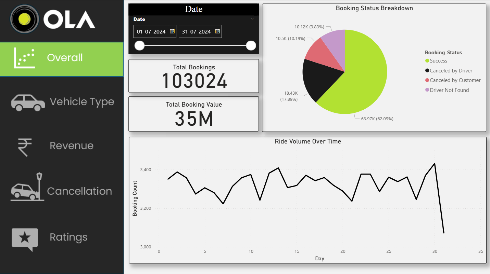
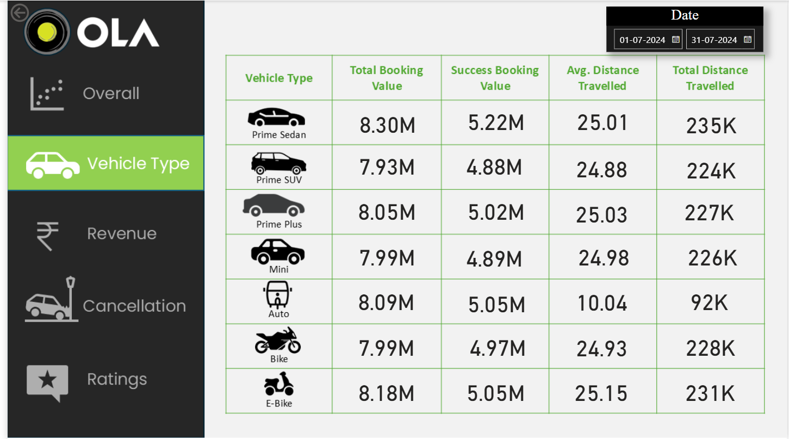
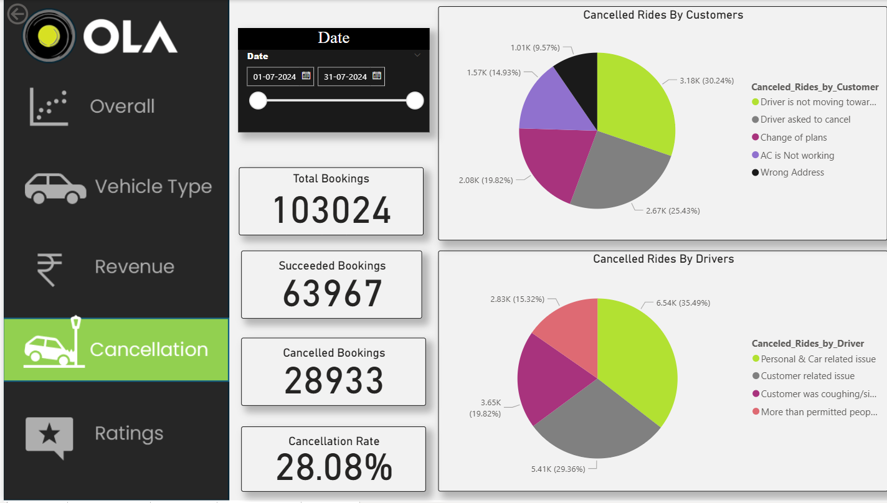
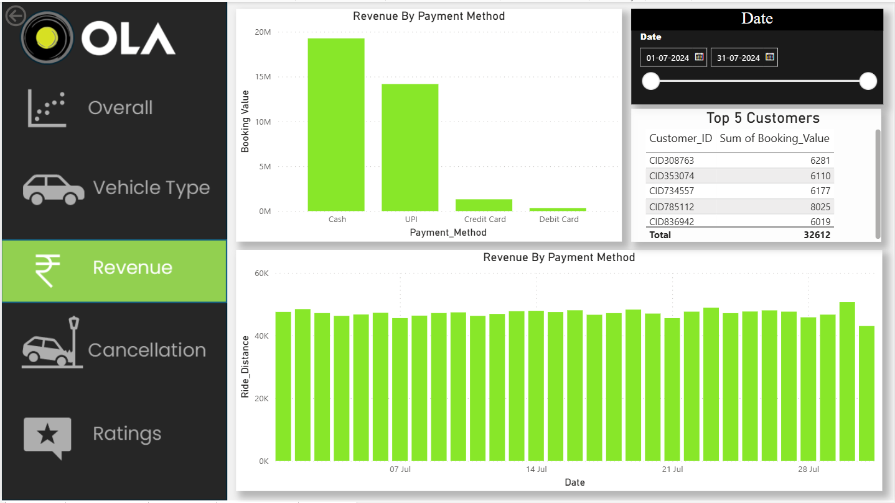
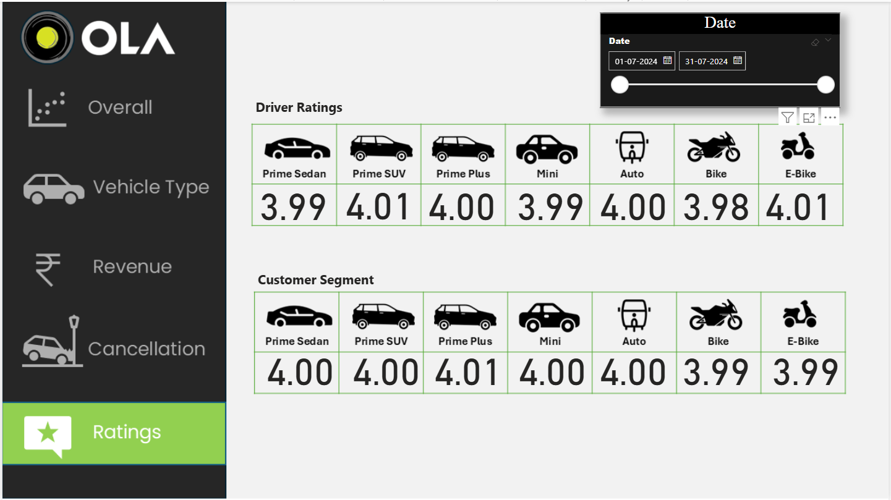

# OLA_Data_Analyst_Project

## 📌 Project Overview  
This project performs an end-to-end data analysis of **Ola ride bookings**, uncovering actionable business insights. It involves **data cleaning**, **SQL querying**, and **interactive visualizations** using **Power BI**, showcasing customer behavior, revenue trends, and operational inefficiencies.  

## 👨‍💻 About the Developer  
**Omkar Gaurav**  
🎓 Aspiring Data Analyst | Skilled in SQL, Power BI, Excel  
📫 [LinkedIn](https://linkedin.com/in/your-profile) • [GitHub](https://github.com/yourusername) • 📧 your.email@example.com

---

## 🚀 Tools & Technologies  
- **SQL (MySQL Workbench)** – Schema design, data cleaning, analysis queries  
- **Excel** – Data structuring and quality checks  
- **Power BI** – Visualization of ride trends and metrics  

---

## 🎯 Objectives  
- Understand booking patterns and ride outcomes  
- Identify top customers and ride distances by vehicle type  
- Analyze cancellation reasons and payment trends  
- Deliver insights through interactive dashboards  

---

## 🧠 What I Did  
✔ Designed a realistic Ola ride booking dataset with 1L rows for Bengaluru  
✔ Cleaned and transformed data using SQL views  
✔ Built Power BI dashboards with insights on booking trends, revenue, and ratings  
✔ Answered 10+ business case questions using SQL and Power BI  

---

## 📂 Project Structure  

```
Ola-Ride-Data-Analysis/
├── SQL/
│   ├── ola_schema.sql                # SQL to create database and table structure
│   ├── data_cleaning.sql            # Queries for cleaning and transforming data
│   ├── views_and_analysis.sql       # SQL views & business insights queries
│   ├── powerbi_questions_answers.sql# SQL answers mapped to Power BI visuals
│
├── Excel/
│   └── cleaned_data.xlsx            # Pre-processed data used in Power BI
│
├── PowerBI_Dashboard/
│   ├── ola_dashboard.pbix           # Final Power BI interactive dashboard file
│   ├── Overall.png                  # Screenshot of 'Overall' page
│   ├── Vehicle_Type.png             # Screenshot of vehicle-wise analysis
│   ├── Revenue.png                  # Revenue by payment method & customers
│   ├── Cancellation.png             # Ride cancellations (driver/customer)
│   ├── Ratings.png                  # Driver & customer ratings by vehicle
│
├── README.md                        # Project documentation

```

---

## 🔍 SQL Queries Breakdown  
### **1️⃣ Successful Bookings**  
```sql
CREATE VIEW Successful_Bookings AS 
SELECT * FROM bookings WHERE Booking_Status = 'Success';
```

### **2️⃣ Average Ride Distance Per Vehicle Type**  
```sql
CREATE VIEW Avg_Ride_Distance AS 
SELECT Vehicle_Type, AVG(Ride_Distance) AS avg_distance 
FROM bookings GROUP BY Vehicle_Type;
```

### **3️⃣ Top 5 Customers with Most Bookings**  
```sql
CREATE VIEW Top_5_Customers AS 
SELECT Customer_ID, COUNT(Booking_ID) AS total_rides 
FROM bookings 
GROUP BY Customer_ID 
ORDER BY total_rides DESC LIMIT 5;
```

### **4️⃣ Total Booking Value of Successful Rides**  
```sql
CREATE VIEW Total_Successful_Ride_Value AS 
SELECT SUM(Booking_Value) AS total_revenue 
FROM bookings WHERE Booking_Status = 'Success';
```

*(More SQL queries can be found in the `/SQL` folder.)*  

---

## 📊 Power BI Dashboard

The dashboard was designed in Power BI to deliver a clear and interactive view of ride booking activity for OLA during a 1-month period in Bengaluru. Each page of the dashboard focuses on a different analytical theme, optimized for business insights.

---

### 🟢 Overall View  
- Total Bookings & Revenue KPIs  
- Booking Status Breakdown (Success, Canceled, Driver Not Found)  
- Ride Volume Over Time (trend chart)



---

### 🚗 Vehicle Type Analysis  
- Booking value per vehicle type  
- Success vs Total Booking Value  
- Avg. and Total Distance Traveled by type



---

### ❌ Cancellation Insights  
- Customer and Driver Cancellation Breakdown  
- Most frequent cancellation reasons  
- Succeeded vs Canceled ride count  
- Overall Cancellation Rate



---

### 💰 Revenue Overview  
- Revenue by Payment Method (Cash, UPI, etc.)  
- Top 5 Customers by Booking Value  
- Daily Ride Distance & Payment Trends



---

### ⭐ Ratings Comparison  
- Driver Ratings per Vehicle Type  
- Customer Ratings per Vehicle Type  
- Rating ranges from 3.98 to 4.01 across all types



--

⚙️ How to Run This Project

1. Clone the repository:

git clone https://github.com/yourusername/OLA_Data_Analyst_Project.git

2. Run SQL queries in MySQL Workbench

3. Use Excel for raw data view & filtering

4. Explore Power BI dashboard using .pbix file

--

📌 Project Insights
🛵 Most rides booked were Prime Sedan and Auto

💳 UPI and Cash were the most used payment modes

😓 Most common cancellation reasons:

Driver not moving toward pickup (customer)

Personal issues (driver)

🔥 Peak ride volumes were observed on weekends and match days

📈 Revenue spikes observed during high-demand periods
